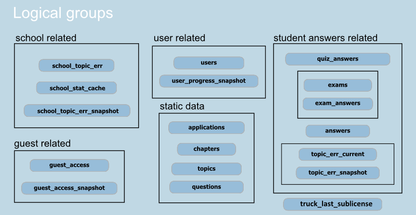

.. include:: defs.hrst

Database structure
==================

|quiz| uses `SQLAlchemy Core <http://sqlalchemy.readthedocs.org/en/rel_0_8/>`_
to access to the database (MySQL). Database structure is created by
:file:`misc/dbinit.py`. It uses the following modules:

* :file:`misc/dbtools/tables.py` - defiles tables and indices.
* :file:`misc/dbtools/func.py` - defines triggers.

All tables may be splitted into several logical groups:

.. _quiz_tables:

static data
    Quiz data.

    * **chapters**:
      Contains list of chapters. Used in exam initialization
      and also provides chapters' titles.

    * **topics**:
      Contains list of questions' topics.
      Provides max and min question's IDs for the topic and also topic's title.

    * **questions**:
      Contains questions for the quizzes and exams.

    * **applications**:
      Contains application keys for various types of client applications.
      Currently info from this table is used while authorization only.
      Application key may be used later to collect statistics.

user related
    Users activity tables and exams statistics history.

    * **user_progress_snapshot**:
      Stores daily snapshots of the user's learning progress.
      Used to provide students rating for the school statistics.
      Updates by the triggers of the **users** table.

    * **users**:
      Contains list of registered students/guests.
      Also last visit time stamp and learning progress is provided.
      Last visit time is used by the :file:`misc/dbtools/update.py`
      script to detect active users and learning progress used to provide
      ratings.
      *AFTER INSERT* and *AFTER UPDATE* triggers updates school activity
      timestamp, guest_access and **user_progress_snapshot** tables.
      *BEFORE DELETE* trigger deletes all user related data from the quiz db.

student answers related
    Quiz and exams answers, list of exams.

    * **quiz_answers**:
      Stores quiz answers.
      Questions from this table will be excluded from future quizzes.
      *AFTER INSERT* and *AFTER UPDATE* triggers updates answers table.

    * **exams**:
      Contains list of students' exams.
      *BEFORE DELETE* trigger deletes all linked answers from the
      **exam_answers**.
      *AFTER UPDATE* trigger updates user's ``progres_coef`` in the
      **users** table.

    * **exam_answers**:
      Stores exam answers.
      *BEFORE UPDATE* trigger updates **answers** table.

    * **answers**:
      Contains quiz and exam answers.
      This table is used by *error review* feature.

      *AFTER INSERT* and *AFTER UPDATE* triggers updates
      **topic_err_current** and **school_topic_err** with current number of
      errors and answers per topic.

    * **topic_err_current**:
      Contains number of topic errors and answers per student.
      Updated after quiz, exam and error review by the **answers**
      table triggers.
      *AFTER INSERT* and *AFTER UPDATE* triggers updates **topic_err_snapshot**
      table. Used to provide student's topics statistics.

    * **topic_err_snapshot**:
      Contains snapshot of the **topic_err_current** state.
      Used to provide student's topics statistics.

guest related
    Guest activity/statistics history tables.

    * **guest_access**:
      Used to limit guest requests.
      *AFTER INSERT* and *AFTER UPDATE* triggers updates
      **guest_access_snapshot**.

    * **guest_access_snapshot**:
      Contains daily snapshots of the **guest_access**.
      Populated by **guest_access** triggers.

school related
    Tables of this group stores statistics data for the school.

    * **school_topic_err**:
      Contains total number of errors and answers per topic for school.
      Used to provide part of the topics statistics for the school.

    * **school_stat_cache**:
      Contains part of the school's statistics: guest visits statistics,
      exams statistics and students rating statistics.
      See :file:`misc/dbtools/update.py` for more info.

    * **school_topic_err_snapshot**:
      Contains daily snapshots of the **school_topic_err** state.
      Updated by stored procedure :func:`update_school_snapshot` in the
      :file:`misc/dbtools/update.py` script.
      Used to create school's topics errors statistics.
      Stored procedure :func:`update_school_snapshot` is created by
      :func:`schools` in the :file:`misc/dbtools/func.py`.
      ``school_topic_err`` and ``school_topic_err_snapshot`` are used in the
      :mod:`quiz.core.schoolmixin`.

extra
    Quiz specific tables.

    * **truck_last_sublicense**:
      Used by truck quiz to store last used sublicense.
      See :func:`_handle_sub_license` in the
      :file:`wsgi/quiz/quiz_truck/__init__.py`.
