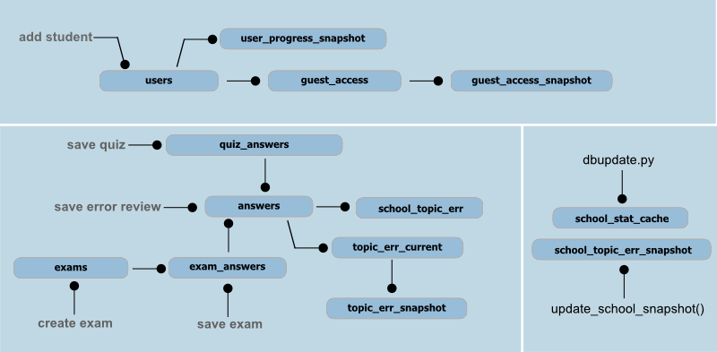

.. include:: defs.hrst

Quiz logic
==========

|quiz| provides quizzes and exams using questions database
(see :ref:`quiz tables <quiz_tables>`).
Also users statistics is collected based on quiz/exam results.
60 days statistics is stored for each user. School statistics is partially
created by the background task :file:`misc/dbupdate.py` which is runs
periodically by the cron.

Next image briefly describes dataflow and relationship between actions
and tables, it also shows some logic aspects (line with circle means
`impacts on`, tables impacts on other tables by triggers):

Quiz
----

Quiz is a set of 40 random questions for the given topic.
Answers are saves in the **quiz_answers** and also in the **answers** table.
It is always contains questions which was not answered in previous quizzes.
To provide this we check **quiz_answers** table.
If all questions are answered then we cleanup **quiz_answers** and
generate quiz again.

Quiz logic is implemented in the :class:`~quiz.core.quizmixin.QuizMixin`.

Exam
----

Exam is a quiz dependent feature. Currently number or questions, total exam time
and other stuff are provided by the ``exam_meta`` in the
:file:`wsgi/quiz/core/exammixin.py`.

Exam expires after 3 hrs after creating and will be removed
by the cleanup script :file:`misc/dbtools/update.py`.

Exam is registered in the **exams** table and it's questions in the
**exam_answers** table.
After exam answers are received we update **exam_answers**, **exams** tables and
also save answers in the **answers** table.
Also **users** table will be touched to update student's progress coef.

Backend related exam logic is implemented in the
:class:`~quiz.core.exammixin.ExamMixin`. Another part is implemented in the
:doc:`frontend <frontends>` part.

Error review
------------

Error review acts almost like quiz but allows student fix wrong answers made
in quiz and exams. It's a set of 40 random questions from the **answers** table.
Review results will be saved back to the **answers** table.

Error review logic is implemented in the
:class:`~quiz.core.reviewmixin.ErrorReviewMixin`.

Student statistics
------------------

Student's statistics is updated after quiz, exam or error review is finished.
More precisely if answer in the **answers** table is updated
then we also update topics statistics table (**topic_err_current**)
for the given question, user and topic.
And after **topic_err_current** updates we also update errors snapshot
(**topic_err_snapshot**).
All this actions are performed mainly by triggers
(see :file:`misc/dbtools/func.py`).

School statistics
-----------------

Part of the school's topics statistics is updated after each student
activity, but only current state (ie last week data is not recalculated).
School statistics snapshots are created by cron script
(see :file:`misc/dbupate.py`).
